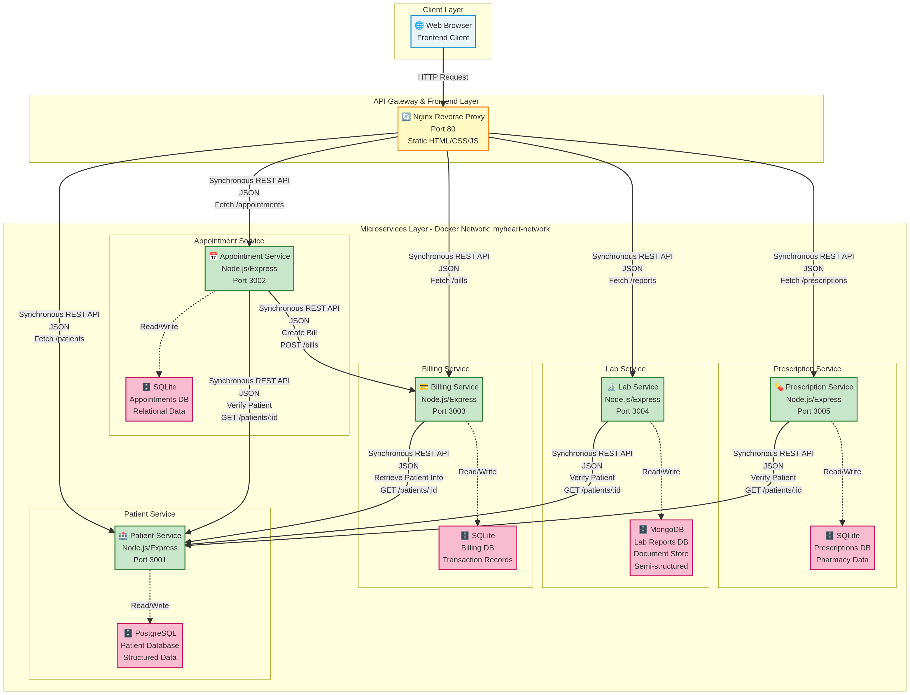

# MyHeart – Système de Gestion des Soins de Santé

## 🏥 Présentation du Projet
**MyHeart** est une application de gestion hospitalière moderne basée sur une **architecture microservices** en séparant les responsabilités métier en services indépendants.

## 🚀 Architecture Technique
Le système est composé de 5 microservices principaux communiquant via des **API REST** :

| Service | Technologie | Rôle | Base de Données (Simulée) |
|---------|-------------|------|---------------------------|
| **Patient Service** | Node.js / Express | Gestion des dossiers patients | PostgreSQL |
| **Appointment Service** | Node.js / Express | Planification des rendez-vous | SQLite |
| **Billing Service** | Node.js / Express | Facturation automatique | SQLite |
| **Lab Service** | Node.js / Express | Résultats d'analyses médicales | MongoDB |
| **Prescription Service** | Node.js / Express | Gestion des ordonnances | SQLite |
| **Frontend** | Nginx / HTML5 | Interface utilisateur | N/A |

## 🏗️ Structure du Projet
```text
My-Heart-Application-Microservices/
├── services/
│   ├── patient-service/       # Gestion des patients
│   ├── appointment-service/   # Gestion des RDV
│   ├── billing-service/       # Facturation
│   ├── lab-service/           # Laboratoire
│   └── prescription-service/  # Pharmacies
├── frontend/                  # Interface Web
└── docker-compose.yml         # Orchestration Docker
```

## 🛠️ Installation et Lancement
Pour démarrer l'ensemble de l'infrastructure, assurez-vous d'avoir **Docker** et **Docker Compose** installés, puis exécutez :

```bash
# Cloner le projet
git clone https://github.com/aboubakertounli/My-Heart-Application-Microservices.git
cd My-Heart-Application-Microservices

# Lancer tous les services
docker-compose up --build
```

Une fois lancé, accédez à l'interface via : `http://localhost:80`

## 📊 Diagramme d'Architecture


---
*Projet réalisé dans le cadre du module Architecture Orientée Services (SOA).*
